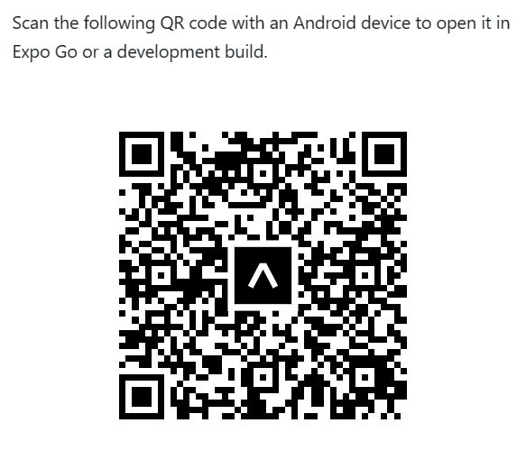
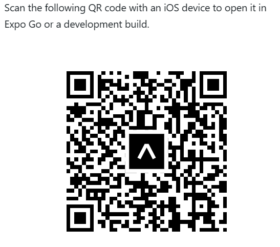

# 🛒 MDSHOP - Ecommerce Mobile App

---

## 📱 Giới thiệu

**MDSHOP** là ứng dụng thương mại điện tử mobile full-stack, cho phép người dùng mua sắm trực tuyến với trải nghiệm mượt mà, đồng thời cung cấp hệ thống quản trị dành cho admin.

---

## 🚀 Demo

| Android | iOS |
|--------|-----|
| Scan QR bằng Expo Go | Scan QR bằng Expo Go |
|  |  |

> ⚠️ Backend dùng free tier → có thể delay ~30s khi khởi động

---

## ✨ Tính năng

### 👤 Người dùng
- 🔍 Duyệt và tìm kiếm sản phẩm  
- 🛒 Thêm vào giỏ hàng  
- 💳 Thanh toán (COD / Stripe)  
- 🔐 Đăng ký / Đăng nhập  
- 🖼️ Upload avatar  
- 🔁 Quên mật khẩu (OTP Email)  

---

### 🛠️ Admin
- 📦 CRUD sản phẩm  
- 📊 Quản lý đơn hàng  
- 🔄 Cập nhật trạng thái đơn  

---

## 🧰 Tech Stack

### Frontend
- React Native  
- Redux Toolkit  
- Expo  
- React Native Paper  

### Backend
- Node.js + Express  
- MongoDB + Mongoose  
- Stripe API  
- Cloudinary  
- JWT Authentication  

---

## 📂 Cấu trúc project
MDSHOP/
│
├── mobile/ # React Native App
├── backend/ # API Server
└── README.md

